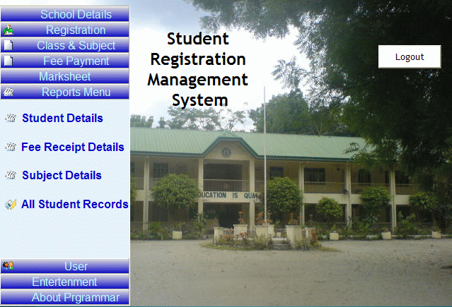



## school fees management system

### Description

Title: School Fees Management System

Description: UserID/Password is ASIF/333

This project developed to keep information about the fees,stdent information.This is fully auto,userfraindly, and well maintaned. Because there was the demand that who will operate this software doesnot know much more about the Software and Computer. So this is developed on the basis of just install software and start working. No setting, No Database creation, no pre-entry of default database etc.

This is a complete software with all need of today live project. It will give you idead about.

After reviewing this project you will get a complete Idea abaout Live Project......

If you feel it is good and feeded you with some knowledge, please VOTE me as well as post comments to gain more Idea about the projects.
 
### More Info
 

             |
---                |---
**Submitted On**   |2009-01-23 01:36:12
**By**             |[ASIF HANIF](https://github.com/Planet-Source-Code/PSCIndex/blob/master/ByAuthor/asif-hanif.md)
**Level**          |Advanced
**User Rating**    |4.2 (42 globes from 10 users)
**Compatibility**  |VB 6\.0, VBA MS Access
**Category**       |[Complete Applications](https://github.com/Planet-Source-Code/PSCIndex/blob/master/ByCategory/complete-applications__1-27.md)
**World**          |[Visual Basic](https://github.com/Planet-Source-Code/PSCIndex/blob/master/ByWorld/visual-basic.md)
**Archive File**   |[school\_fee214285262009\.zip](https://github.com/Planet-Source-Code/asif-hanif-school-fees-management-system__1-71727/archive/master.zip)

